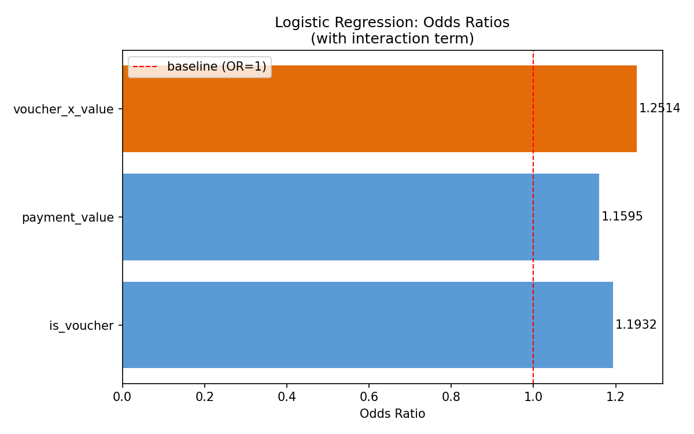

# Olist 订单取消风险分析：支付方式与金额的交互效应

> 本项目是 [Olist 电商经营分析](https://github.com/wnt0801/olist-ecommerce-analysis) 的延伸建模分析。
> 描述性分析阶段发现高金额 Voucher 订单取消率异常，本项目通过精确检验与逻辑回归，验证该差异在控制变量与样本不平衡条件下是否仍然显著。

---

## 项目背景

在经营分析项目中，通过 SQL 多维度拆解发现：

- 取消订单均价 157.71，高于完成订单均价 136.39，高出约 16%
- 在 300+ 高价区间，纯 Voucher 订单取消率达 20%，同价位纯信用卡仅 0.79%，差距约 25 倍
- 66% 的取消发生在下单后 1 小时内，属于即时反悔型风险而非履约问题

但描述性统计无法排除"Voucher 订单本身金额更高"的混淆因素。本项目通过两步验证回应该问题：先用 Fisher 精确检验确认高价区间差异的统计显著性，再用逻辑回归在全量数据上估计支付方式与金额的独立效应及组合放大效应。

---

## 核心问题

控制订单金额后，Voucher 支付方式是否仍然显著提高取消概率？高金额与 Voucher 的组合，是否存在超出单独效应的额外风险放大？

---

## 数据来源

- 数据集：Brazilian E-Commerce Public Dataset by Olist（Kaggle）
- 核心使用表：`olist_orders_dataset`、`olist_order_payments_dataset`
- 分析样本：78,126 条订单，仅保留 voucher 与 credit_card 支付方式
- 目标变量：`is_canceled`（取消=1，未取消=0）
- 样本分布：未取消 77,606 条，取消 520 条，比例约 149:1
- 样本不平衡处理：在交叉表分析中使用 Fisher 精确检验，回归模型通过显著性检验与置信区间评估稳健性

---

## 数据处理

通过 SQL 完成多表关联与数据清洗，主要逻辑：

- `orders` 表与 `order_payments` 表关联，统一到订单粒度
- 同一订单存在多条支付记录时，使用 `ROW_NUMBER()` 取金额最大者作为主支付方式
- 筛选口径：仅保留 voucher 与 credit_card，排除 boleto 等其他支付方式

---

## 分析方法

分析路径分为三层，分别回答不同精度的问题。

**第一层 · Fisher 精确检验**（300+ 区间，纯单一支付口径）

直接比较高价区间两种支付方式的取消率差异。受限于该子集中 Voucher 样本量（n=75），采用精确检验避免大样本卡方近似失效。

**第二层 · 基础逻辑回归**（全量数据）

特征：`is_voucher`（支付方式 0/1 编码）、`payment_value`（订单金额）。估计两者对取消概率的独立效应，验证控制金额后 Voucher 效应是否仍显著。

**第三层 · 交互项逻辑回归**（全量数据）

新增特征 `voucher_x_value = is_voucher × payment_value`。验证"高金额 + Voucher"是否存在超出单独效应的组合放大。模型用 statsmodels Logit 拟合，输出系数、p 值、95% 置信区间。

---

## 核心结论

**Fisher 精确检验**（300+ 区间）

| 指标 | 数值 |
|------|------|
| Voucher 取消率 | 20.00%（15/75） |
| Credit_card 取消率 | 0.79%（65/8268） |
| Odds Ratio | 31.55 |
| p-value | < 0.000001 |

高价区间 Voucher 取消风险极显著高于信用卡，差异不可能由抽样波动解释。

**基础逻辑回归**（全量数据，n=78,126）

| 变量 | OR | 95% CI | p-value |
|------|----|--------|---------|
| is_voucher | 1.39 | [1.33, 1.45] | < 0.0001 |
| payment_value | 1.15 | [1.10, 1.21] | < 0.0001 |

控制金额后，Voucher 支付本身仍独立提升取消概率约 39%，金额每升高一个标准差额外提升约 15%。两个效应都不被对方解释掉，排除了"Voucher 取消率高仅因金额高"的混淆假设。

**交互项逻辑回归**（全量数据）

| 变量 | OR | 95% CI | p-value |
|------|----|--------|---------|
| is_voucher | 1.30 | [1.23, 1.37] | < 0.0001 |
| payment_value | 1.10 | [1.05, 1.16] | < 0.0001 |
| voucher_x_value | 1.09 | [1.06, 1.13] | < 0.0001 |

交互项显著为正，且模型 AIC 从 6083 降至 6049，说明加入交互项是有效信息而非噪声。在 Voucher 用户中，金额对取消率的放大作用比信用卡用户更强，组合风险并非简单叠加。



三层分析互相印证：高价区间的极端差异（Fisher OR=31.55）在全量数据上被分解为支付方式独立效应、金额独立效应与组合放大效应三个分量，都在统计上显著。

---

## 局限性

- 300+ 区间纯 Voucher 订单仅 75 条，Fisher 检验置信区间较宽，结论反映强信号但需更大样本验证
- 回归模型未引入买家、卖家、品类等控制变量，部分效应可能被未观测因素吸收
- 数据为 2016–2018 年巴西市场，结论的外部效度需谨慎推广

---

## 业务建议

与经营分析项目结论保持一致：

- 对 300+ 的纯 Voucher 订单增加支付后确认环节，干预窗口明确（66% 取消发生在首小时内）
- 若将 Voucher 取消率降至信用卡同水平，预计可减少 72 单取消，挽回 GMV 约 19,658 
- 该风险组合特征明确、可干预、损失可量化，适合作为优先治理对象

---

## 技术栈

- 数据提取：SQL（CTE、窗口函数 `ROW_NUMBER`、多表 JOIN）
- 建模：Python / statsmodels（Logit 含置信区间）/ scipy（Fisher 精确检验）
- 数据处理：pandas / numpy / scikit-learn（StandardScaler）
- 可视化：matplotlib

---

## 文件结构

```
├── data/                        # 数据文件（已加入 .gitignore）
├── notebooks/
│   └── 01_modeling.py           # 完整建模代码（含描述性背景、Fisher 检验与回归）
├── outputs/
│   └── figures/
│       └── odds_ratio.png       # Odds Ratio 可视化（含 95% CI 误差棒）
├── requirements.txt
└── README.md
```
